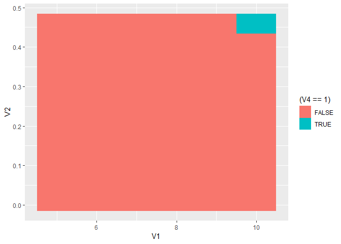
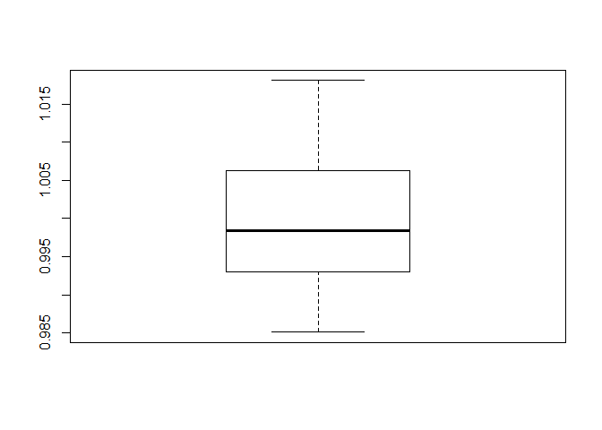

Coin Flip 21
================
M Johnston
30 May 2019

Functions for later
-------------------

``` r
nCr <- function(n,r) factorial(n)/(factorial(r)*factorial(n-r))
binom<-function(success,flips,prob) nCr(flips,success)*prob^success*(1-prob)^(flips-success)
possibilities <- function(n) distinct(as.data.frame(t(combn(rep(c(F,T),n),n,NULL,T))))
likelihood <- function(x, n,prob=0.5) prob^x*(1-prob)^(n-x)
splitter <- function(values, N){
  inds = c(0, sapply(1:N, function(i) which.min(abs(cumsum(as.numeric(values)) - sum(as.numeric(values))/N*i))))
  dif = diff(inds)
  re = rep(1:length(dif), times = dif)
  return(split(values, re))
}
```

Compute the number of flips for 21 astronauts
---------------------------------------------

``` r
people<-21
mintosses <- ceiling(log2(people))
maxtosses<-10
result<-NULL

for (i in mintosses:maxtosses){
  for (j in seq(0.01,0.5,0.05)){
    a <- possibilities(i)
    a <- cbind(a,sum=apply(a,1,sum))
    a <- cbind(a, chance=sapply(a$sum,likelihood,n=i,prob=j))
    split<-splitter(a$chance,people)
    result<-rbind(result,c(i,j,sum(abs(sapply(split, sum)-1/people)),all(abs(sapply(split, sum)-1/people)<0.001)))
  }
}

result<-as.data.frame(result)
```

Are any of them good enough?

``` r
ggplot(result, aes(x=V1, y=V2, fill=(V4==1)))+geom_raster(interpolate=F)
```



``` r
head(result[result$V4==1,],1)
```

    ##    V1   V2          V3 V4
    ## 60 10 0.46 0.007669821  1

We get some within bounds at 10 flips, let's look closer:

``` r
a <- possibilities(10)
a <- cbind(a,sum=apply(a,1,sum))
a <- cbind(a, chance=sapply(a$sum,likelihood,n=10,prob=.46))
split<-splitter(a$chance,people)
print(sapply(split, sum))
```

    ##          1          2          3          4          5          6 
    ## 0.04734304 0.04767890 0.04822033 0.04734968 0.04737230 0.04727875 
    ##          7          8          9         10         11         12 
    ## 0.04847978 0.04754237 0.04691012 0.04791575 0.04810628 0.04718747 
    ##         13         14         15         16         17         18 
    ## 0.04798685 0.04697611 0.04754237 0.04827784 0.04728441 0.04764161 
    ##         19         20         21 
    ## 0.04786750 0.04785054 0.04718800

``` r
boxplot(sapply(split, sum)*21)
```


