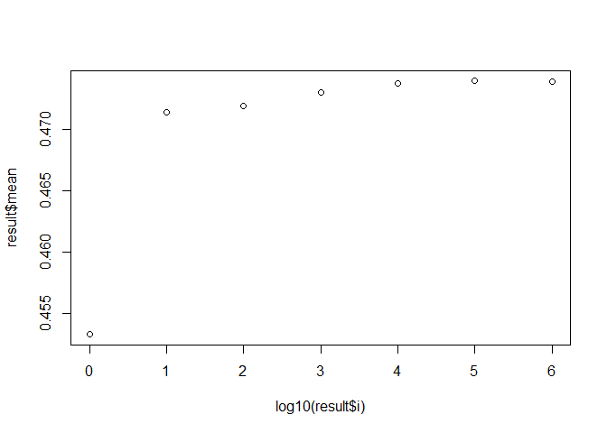
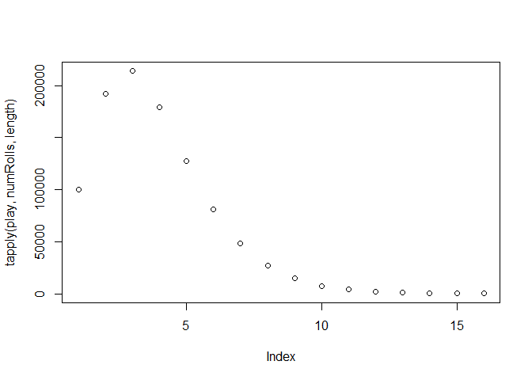
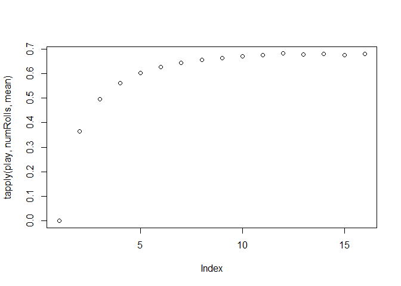

Magic Dice Game
================
M Johnston
19 November 2019

Answer
------

Mean number: 0.474 (3 s.f.)

How Low Can You Roll?
---------------------

<https://fivethirtyeight.com/features/how-low-can-you-roll/> Nov. 15, 2019

Completed 19/11/2019

Riddler Classic

From Ricky Jacobson comes a puzzle of seeing how low you can roll:

You are given a fair, unweighted 10-sided die with sides labeled 0 to 9 and a sheet of paper to record your score. (If the very notion of a fair 10-sided die bothers you, and you need to know what sort of three-dimensional solid it is, then forget it - you have a random number generator that gives you an integer value from 0 to 9 with equal probability. Your loss - the die was a collector's item.)

To start the game, you roll the die. Your current "score" is the number shown, divided by 10. For example, if you were to roll a 7, then your score would be 0.7. Then, you keep rolling the die over and over again. Each time you roll, if the digit shown by the die is less than or equal to the last digit of your score, then that roll becomes the new last digit of your score. Otherwise you just go ahead and roll again. The game ends when you roll a zero.

For example, suppose you roll the following: 6, 2, 5, 1, 8, 1, 0. After your first roll, your score would be 0.6, After the second, it's 0.62. You ignore the third roll, since 5 is greater than the current last digit, 2. After the fourth roll, your score is 0.621. You ignore the fifth roll, since 8 is greater than the current last digit, 1. After the sixth roll, your score is 0.6211. And after the seventh roll, the game is over - 0.6211 is your final score.

What will be your average final score in this game?

Set up the mechanics
====================

``` r
magicDice <- function() sample(0:9, 1)
print(magicDice())
```

    ## [1] 2

``` r
playAGame <- function(){
  currentNumber<-NULL
  previousRoll<-9
  while(T){
    roll <- magicDice()
    if (roll == 0){
      currentNumber<-as.numeric(paste0("0.",currentNumber))
      return(currentNumber)
    }
    else if (roll <= previousRoll){
      currentNumber<-paste0(currentNumber,as.character(roll))
      previousRoll<-roll
    }

  }
}
print(playAGame())
```

    ## [1] 0.32

Finding the mean, median
------------------------

Lets generate a large number of numbers and view their properties.

``` r
 n<-1000000
 play<-replicate(n, playAGame(), simplify=T)
 mean(play)
```

    ## [1] 0.4738928

``` r
 median(play)
```

    ## [1] 0.4444411

Check convergence.

``` r
 N <- c(1,10,100,1000,10000,100000, 1000000)
result<-NULL
for (i in N){
  mean<-mean(replicate(100,mean(sample(play, i, T)),simplify=T))
  result<- rbind(result,cbind(i,mean))
}
result<-as.data.frame(result)
plot(log10(result$i), result$mean)
```



Number of rolls
---------------

Each game consists of a number of rolls, whats the average game length?

``` r
sigFig<-function(x) length(gregexpr("[[:digit:]]", as.character(x))[[1]])  #https://r.789695.n4.nabble.com/How-to-find-the-significant-digits-of-a-number-td964918.html
numRolls<- sapply(play, sigFig, simplify = T)

mean(numRolls)
```

    ## [1] 3.830909

``` r
median(numRolls)
```

    ## [1] 3

``` r
numRolls<-as.factor(numRolls)
plot(tapply(play, numRolls, length))
```

 \# How does game average change with number of rolls?

``` r
tapply(play, numRolls, mean)
```

    ##         1         2         3         4         5         6         7 
    ## 0.0000000 0.3648378 0.4960882 0.5615160 0.6020288 0.6274136 0.6431828 
    ##         8         9        10        11        12        13        14 
    ## 0.6568668 0.6626368 0.6699645 0.6751248 0.6813490 0.6782900 0.6794971 
    ##        15        16 
    ## 0.6763087 0.6798466

``` r
plot(tapply(play, numRolls, mean))
```


